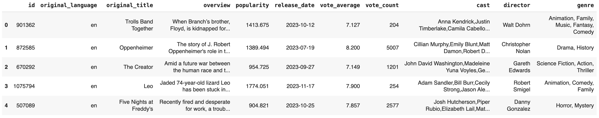
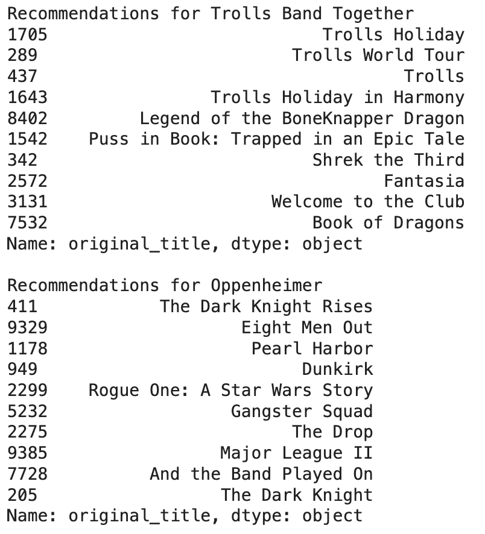

# Movie Minds
<p align="center"></p>

The proposed project is an integrated movie recommendation system based on The Movie Database ([TMDb](https://www.themoviedb.org/)). Through the use of TMDb APIs, data on the most popular films are acquired and consolidated into a CSV file containing all available information. <br/><br/>

**Key Features:**
1. Search and Recommendation:<br/>
The system allows to search and receive personalized recommendations by entering features such as genre, plot, cast, or other adjustable parameters.
Through a recommendation algorithm, the system predicts the most suitable films based on the specified features.
2. Comparison with TMDb:<br/>
The results of the recommendation system are compared with direct recommendations from TMDb to evaluate its effectiveness.
3. Plot Generation: <br/>
Another function of the system allows to generate invented movie plots.
The system returns a list of films compatible with the provided plot, indicating the percentage of similarity through natural language processing (NLP) techniques.
4. Poster Analysis with Keras and VGG19:<br/>
Poster analysis is performed using Keras and the VGG19 model.
The system identifies movie covers similar to those in a dataset based on visual features of the posters.

## Installation
1. Clone the repository

```bash
git clone https://github.com/ManciSee/Movie-Minds.git
cd nome_progetto
```
2. Set Up the Virtual Environment (Optional but Recommended)
```bash
python -m venv venv
source venv/bin/activate   # for Linux/Mac users
venv\Scripts\activate      # for Windows users
```
3. Start the Jupyter Notebook
```bash
jupyter notebook
```

## Examples
1. Movie Dataset
<p align="center"></p>

2. Recommendations for two films
<p align="center"></p>

4. Movie Recommendations Based on Cover Art Example
<p align="center"></p>

## License
[GNU GPLv3](https://choosealicense.com/licenses/gpl-3.0/)


    
